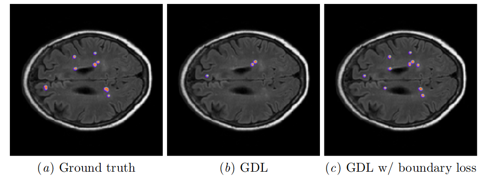

# Boundary loss
Code for our MIDL 2019 submission: [Boundary loss for highly unbalanced segmentation](https://openreview.net/forum?id=S1gTA5VggE)


## Requirements
Non-exhaustive list:
* python3.6+
* Pytorch 1.0
* nibabel
* Scipy
* NumPy
* Matplotlib
* Scikit-image
* zsh

## Usage
Instruction to download the data are contained in the lineage files [ISLES.lineage](data/ISLES.lineage) and [wmh.lineage](data/wmh.lineage). They are just text files containing the md5sum of the original zip.

Once the zip is in place, everything should be automatic:
```
make -f isles.make
make -f wmh.make
```
Usually takes a little bit more than a day per makefile.

This perform in the following order:
* Unpacking of the data
* Remove unwanted big files
* Normalization and slicing of the data
* Training with the different methods
* Plotting of the metrics curves
* Display of a report
* Archiving of the results in an .tar.gz stored in the `archives` folder

The main advantage of the makefile is that it will handle by itself the dependencies between the different parts. For instance, once the data has been pre-processed, it won't do it another time, even if you delete the training results. It is also a good way to avoid overwriting existing results by relaunching the exp by accident.

Of course, parts can be launched separately :
```
make -f isles.make data/isles # Unpack only
make -f isles.make data/ISLES # unpack if needed, then slice the data
make -f isles.make results/isles/gdl # train only with the GDL. Create the data if needed
make -f isles.make results/isles/val_dice.png # Create only this plot. Do the trainings if needed
```
There is many options for the main script, because I use the same code-base for other projects. You can safely ignore most of them, and the different recipe in the makefiles should give you an idea on how to modify the training settings and create new targets. In case of questions, feel free to contact me.

## Data scheme
### datasets
For instance
```
ISLES/
    train/
        cbf/
            case_10_0_0.png
            ...
        cbv/
        gt/
        in_npy/
            case_10_0_0.npy
            ...
        gt_npy/
        ...
    val/
        cbf/
            case_10_0_0.png
            ...
        cbv/
        gt/
        in_npy/
            case_10_0_0.npy
            ...
        gt_npy/
        ...
```
The network takes npy files as an input (because there is several modalities), but images for each modality are saved for convenience. The gt folder contains gray-scale images of the ground-truth, where the gray-scale level are the number of the class (namely, 0 and 1). This is because I often use my [segmentation viewer](https://github.com/HKervadec/segmentation_viewer) to visualize the results, so that does not really matter. If you want to see it directly in an image viewer, you can either use the remap script, or use imagemagick:
```
mogrify -normalize data/ISLES/val/gt/*.png
```

### results
```
results/
    isles/
        gdl/
            best_epoch/
                val/
                    case_10_0_0.png
                    ...
            iter000/
                val/
            ...
        gdl_surface_steal/
            ...
        best.pkl # best model saved
        metrics.csv # metrics over time, csv
        best_epoch.txt # number of the best epoch
        val_dice.npy # log of all the metric over time for each image and class
        val_dice.png # Plot over time
        ...
    wmh/
        ...
archives/
    $(REPO)-$(DATE)-$(HASH)-$(HOSTNAME)-isles.tar.gz
    $(REPO)-$(DATE)-$(HASH)-$(HOSTNAME)-wmh.tar.gz
```

## Interesting bits
The losses are defined in the [`losses.py`](losses.py) file. The [`utils.py`](utils.py) contains the function that actually compute the distance maps (`one_hot2dist`). Explaining the remaining of the code is left as an exercise for the reader.

## Cool tricks
Remove all assertions from the code. Usually done after making sure it does not crash for one complete epoch:
```
make -f isles.make <anything really> CFLAGS=-O
```

Use a specific python executable:
```
make -f isles.make <super target> CC=/path/to/the/executable
```

Train for only 5 epochs, with a dummy network, and only 10 images per data loader. Useful for debugging:
```
make -f isles.make <really> NET=Dimwit EPC=5 DEBUG=--debug
```

Rebuild everything even if already exist:
```
make -f isles.make <a> -B
```

Only print the commands that will be run:
```
make -f isles.make <a> -n
```

Create a gif for the predictions over time of a specific patient:
```
cd results/isles/gdl
convert iter*/val/case_14_0_0.png case_14_0_0.gif
mogrify -normalize case_14_0_0.gif
```